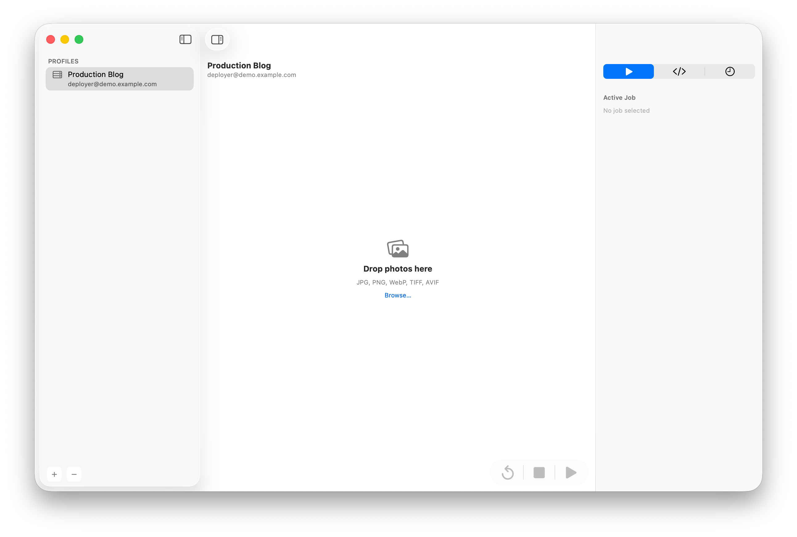
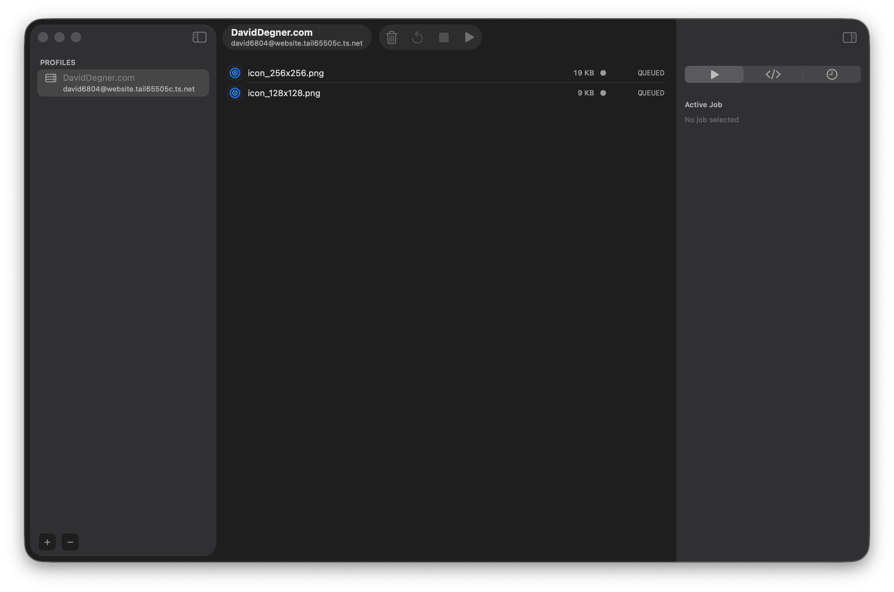
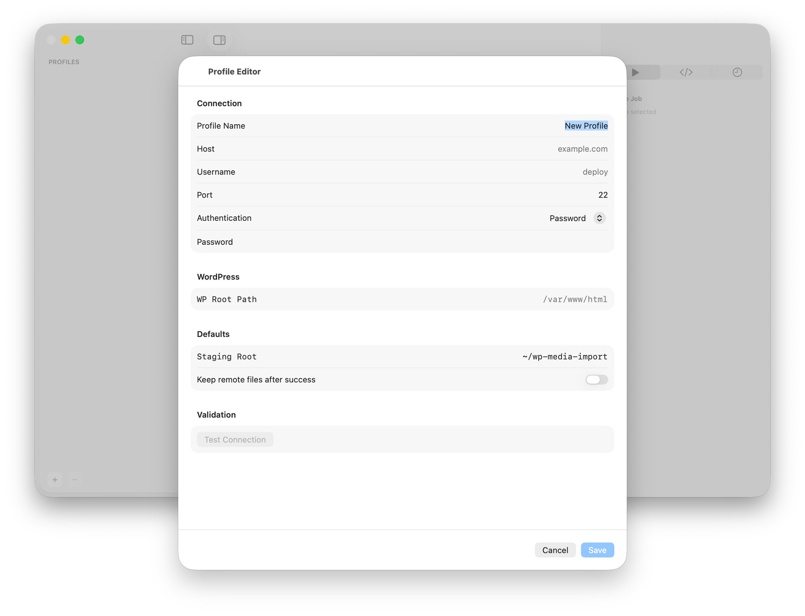

# WP Media Uploader

[Download macOS binary (v1.0)](https://github.com/ddegner/wp-media-uploader/releases/download/v1.0/WPMediaUploader-v1.0-macOS.zip)

WordPress media uploader with SSH + WP-CLI automation.
An independent, open source macOS app to upload media to WordPress sites.

Designed for speed and reliability, it uses `rsync`, `ssh`, and `wp-cli` to handle large media libraries efficiently.

**Version 1.0** · macOS 14+

[Privacy Policy](PRIVACY.md)

## Screenshots

Quick visual tour of the app workflow:

- **Overview** — three-pane workspace with profiles, drop zone, and operations drawer.


- **Queue + job status** — queued files, per-file state, and active job progress in one view.


- **Profile setup** — complete connection and WordPress settings in the built-in profile editor.


## Features

- **Single-window profile setup** — connection, WordPress path, import defaults
- **Multiple server profiles**
- **Credentials stored in Keychain** — password auth and optional key passphrase
- **SSH auth modes** — key-based (agent-friendly) or password via `SSH_ASKPASS`
- **Drag-and-drop & file picker** — JPG, JPEG, JPE, GIF, PNG, BMP, ICO, WebP, AVIF, HEIC, PDF
- **Reliable job pipeline** — preflight → upload (`rsync`) → verify → import (`wp media import`) → regenerate thumbnails → cleanup
- **Retry failed files** without reprocessing successful ones
- **Streaming logs** in-app + persisted log files
- **Reports** — copy text, export JSON or CSV

## Requirements

- macOS 14 (Sonoma) or later
- Xcode 16+ (to build from source)
- SSH access to target server
- `wp-cli` installed on the remote server
- WordPress installation on the remote server

## Build

```bash
swift build
```

## Test

```bash
swift test
```

## Run

```bash
swift run WordpressMediaUploaderApp
```

Or open the Xcode project and run from there:

```bash
xcodegen generate
open "WordpressMediaUploader.xcodeproj"
```

## Distribution (Signed + Notarized)

Use the release script (this is the default distribution path):

```bash
./scripts/build_distribution.sh
```

Credentials for notarization:

- Preferred: set `NOTARY_KEYCHAIN_PROFILE` to a notarytool keychain profile name.
- Default fallback: if unset, the script uses `notary-profile`.
- Alternative: set `APPLE_ID`, `APPLE_TEAM_ID`, and `APPLE_APP_SPECIFIC_PASSWORD`.

The script will:

- Build a Release app
- Sign with Developer ID (`DEVELOPER_ID_APP_CERT`, defaults to this repo's Developer ID cert)
- Submit for notarization and wait for acceptance
- Staple the notarization ticket
- Produce `WPMediaUploader-v<version>-macOS.zip`
- Ensure git tag `v<version>` points to `HEAD` and is pushed to `origin`
- Create or update GitHub Release `v<version>` (marked latest) with zip + `sha256.txt`
- Send a macOS notification on success/failure

GitHub release publishing controls:

- Default: enabled (`PUBLISH_GITHUB_RELEASE=1`)
- Disable: set `PUBLISH_GITHUB_RELEASE=0`
- Override repo slug detection: set `GITHUB_REPO=owner/repo`
- Requires authenticated GitHub CLI (`gh auth status`)

### GitHub Actions Automation (Releases + Packages)

Tag pushes (`v*`) trigger `.github/workflows/release-package.yml`, which runs the same native release flow:

- Build Release app
- Sign, notarize, and staple
- Publish GitHub Release assets
- Publish a GitHub Package (GHCR OCI artifact) containing the zip + `sha256.txt`

Required repository secrets:

- `DEVELOPER_ID_CERT_P12_BASE64`
- `DEVELOPER_ID_CERT_PASSWORD`
- `KEYCHAIN_PASSWORD`
- `DEVELOPER_ID_APP_CERT`
- `APPLE_ID`
- `APPLE_TEAM_ID`
- `APPLE_APP_SPECIFIC_PASSWORD`

Optional repository secret:

- `NOTARY_KEYCHAIN_PROFILE` (defaults to `notary-profile`)

## App Store Connect Submission

For the verified App Store Connect auth + submission workflow (including WP Media Uploader and Cat Scratches app IDs), see:

- `APP_STORE_CONNECT_SUBMISSION_RUNBOOK.md`

## How It Works

1. **Create a server profile** with your SSH credentials and WordPress root path
2. **Drop images** onto the app (or use Browse)
3. **Click Upload** — the app will:
   - Verify SSH connectivity and `wp-cli` availability
   - Upload files via `rsync` with progress tracking
   - Verify remote file integrity (size check)
   - Import each file into WordPress media library
   - Regenerate thumbnails
   - Optionally clean up remote staging files

## Notes

- Default staging path is `~/wp-media-import`
- Job and profile data are saved under `~/Library/Application Support/WPMediaUploader/`
- Passwords and key passphrases are stored in the macOS Keychain

## License

MIT
